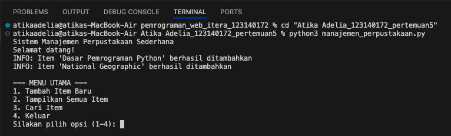
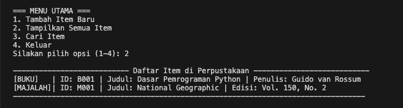
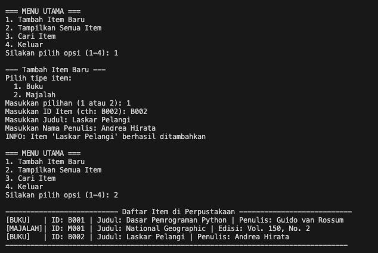
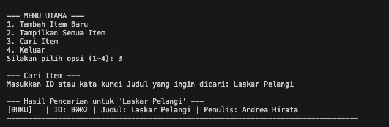
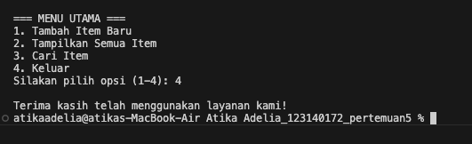

# DOKUMENTASI PRAKTIKUM PAW PERTEMUAN KE-5

1. Penjelasan singkat tentang fungsi program dan fitur-fiturnya
    Sesuai ketentuan tugas yang ada, sistem ini adalah sistem yang manajemen perpustakaan sederhana, yang mana fiturnya yaiut : 
    - Menambahkan item ke perpustakaan : Menambahkan item buku atau majalah ke sistem 
    - Menampilkan daftar item yang tersedia : Menampilkan item buku atau majalah yang ada atau yang baru saja diinput
    - Mencari item berdasarkan judul atau id : Mencari item buku dan majalah berdasarkan ISBN dan Judul 

2. Screenshot hasil running program
    - Tampilan awal : 

      

    - Tampilan melihat semua item yang ada 

      

    - Tampilan tambah item baru (buku) dan melihat semua item (termasuk yang baru ditambahkan)

      

    - Tampilan cari item 

      

    - Tampilan keluar dari sistem 
      
      

3. Diagram class (opsional, nilai tambah) 

# DOKUMENTASI PRAKTIKUM PAW PERTEMUAN KE-5